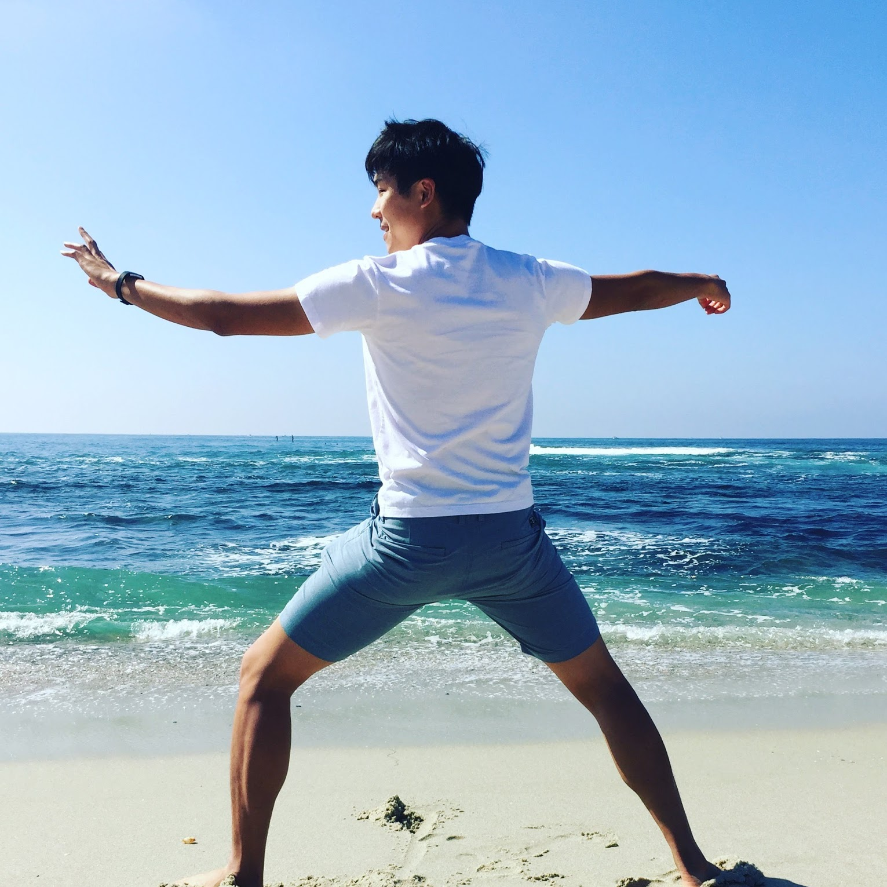

---
pandoc:
  rewriteClass:
    avatar: m-4 h-48 rounded-full float-left
tags: 
- home
- people
---
# About Me
{.avatar}

Hi, I'm Edward.  This is a journal of my notes and insights into my practice of Chen-style Taijiquan [[practicalmethod]].
Professionally, I work as a software engineer on bioinformatics applications and data pipelines, which may also be the topic of some of my musings.
